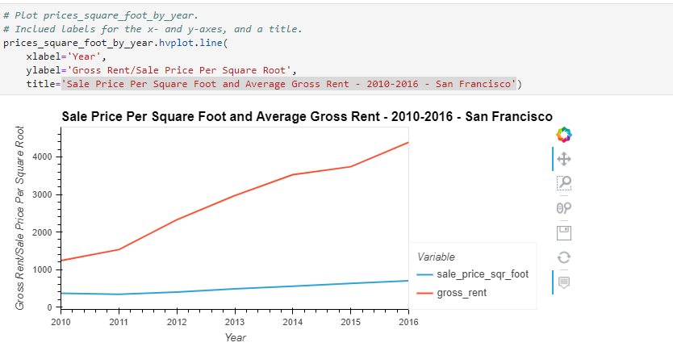
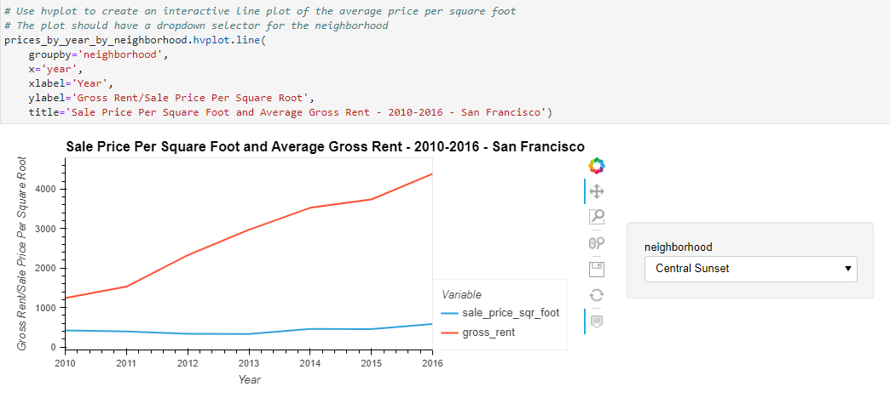

# Analyze-San-Francisco-Real-Estate-Market
This application is to use data visualization skills, including aggregation, interactive visualizations, and geospatial analysis, to find properties in the San Francisco market that are viable investment opportunities.

The main task is to visualize and analyze the real-estate data to complete the following tasks:

    Calculate and plot the housing units per year.

    Calculate and plot the average prices per square foot.

    Compare the average prices by neighborhood.

    Build an interactive neighborhood map.

    Compose your data story. 

---

## Technologies

This project leverages Anaconda and JupyterLab with Python 3.9:

* [Anaconda](https://www.anaconda.com/products/individual) 

Need to import the following libraries and dependencies:

```
import pandas as pd
import hvplot.pandas
from pathlib import Path

```

---

## Installation Guide

Before running the application first install the following dependencies.

### Part I--Install Anaconda
1. Install [Anaconda](https://www.anaconda.com/products/individual) from link 
2. Open up GitBash(Windows) or Terminal(Mac)
3. Type ```conda update conda``` to update Conda
4. Type ```conda update anaconda``` to update Anaconda
5. Type ```conda create -n dev python=3.9 anaconda```
6. Type ```conda activate dev``` to activate conda
7. Install a dev environment kernel by typing ```python -m ipykernel install --user --name dev```
8. Install a node environment by typing ```conda install -c conda-forge nodejs```
9. Launch JupyterLab by typing ```jupyter lab```

### Part II--Install the PyViz Ecosystem


PyViz is a Python visualization package that provides a single platform for accessing multiple visualization libraries. Two of these libraries are hvPlot and GeoViews, which we’ll use during this module.

To install PyViz and its dependencies in our Conda ```dev``` environment, complete the following steps:

From your terminal, log in to your Conda ```dev``` environment.

Install the PyViz packages by using the ```conda install``` command as follows:

```
conda install -c pyviz hvplot geoviews

```
That's all you need for installation. 


## Usage

You will need to clone the repo so that you can run the application:

```
 git clone https://github.com/locthai2002/Analyze-San-Francisco-Real-Estate-Market.git

```

Here are some screenshots from running the application:

## Import the Libararies


## Calculate and Plot the Housing Units per Year


## Calculate and Plot the Average Sale Prices per Square Foot



## Compare the Average Sale Prices by Neighborhood



## Build an Interactive Neighborhood Map


---

## Contributors

Loc Thai -- www.linkedin.com/in/loc-thai-69b8a2141
Phone: 415.400.9998

---

## License

MIT


